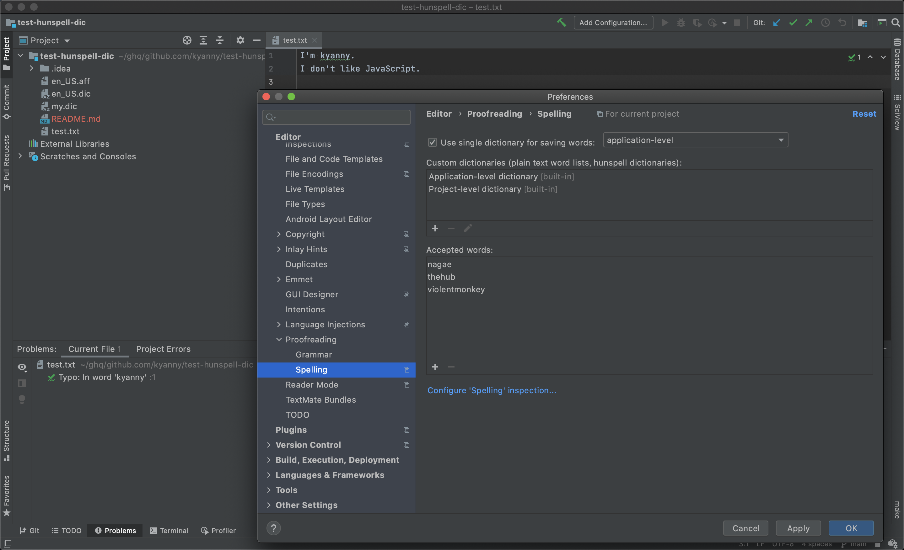
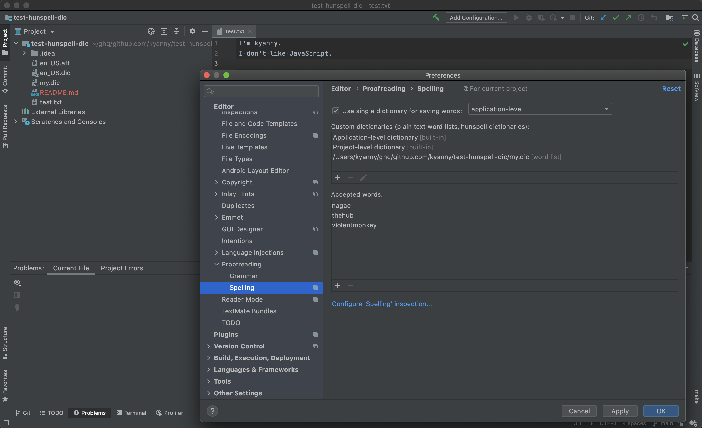

`en_US` dictionary files are downloaded by following [hunspell's official document](https://github.com/hunspell/hunspell#usage).

```
wget -O en_US.aff 'https://cgit.freedesktop.org/libreoffice/dictionaries/plain/en/en_US.aff?id=a4473e06b56bfe35187e302754f6baaa8d75e54f'
wget -O en_US.dic 'https://cgit.freedesktop.org/libreoffice/dictionaries/plain/en/en_US.dic?id=a4473e06b56bfe35187e302754f6baaa8d75e54f'
```

# `hunspell` without personal dictionary

```
~/ghq/github.com/kyanny/test-hunspell-dic main*
❯ hunspell -d en_US -l test.txt
kyanny.
```

# `hunspell` with personal dictionary

```
~/ghq/github.com/kyanny/test-hunspell-dic main*
❯ hunspell -d en_US -p my.dic -l test.txt
JavaScript.
hunspell(31530,0x116e88dc0) malloc: *** error for object 0x7ff49a805e80: pointer being freed was not allocated
hunspell(31530,0x116e88dc0) malloc: *** set a breakpoint in malloc_error_break to debug
zsh: abort      hunspell -d en_US -p my.dic -l test.txt
```

# IntelliJ IDEA Ultimate spellcheck without personal dictionary



# IntelliJ IDEA Ultimate spellcheck with personal dictionary



# Versions

```
❯ hunspell -v
@(#) International Ispell Version 3.2.06 (but really Hunspell 1.7.0)


Copyright (C) 2002-2014 László Németh. License: MPL/GPL/LGPL.

Based on OpenOffice.org's Myspell library.
Myspell's copyright (C) Kevin Hendricks, 2001-2002, License: BSD.

This is free software; see the source for copying conditions.  There is NO
warranty; not even for MERCHANTABILITY or FITNESS FOR A PARTICULAR PURPOSE,
to the extent permitted by law.
```

```
❯ hunspell -vv
@(#) International Ispell Version 3.2.06 (but really Hunspell 1.7.0)
```

```
❯ sw_vers
ProductName:	Mac OS X
ProductVersion:	10.15.7
BuildVersion:	19H524
```

```
IntelliJ IDEA 2020.3.3 (Ultimate Edition)
Build #IU-203.7717.56, built on March 15, 2021
Licensed to Kensuke Nagae
Subscription is active until May 31, 2021.
Runtime version: 11.0.10+8-b1145.96 x86_64
VM: OpenJDK 64-Bit Server VM by JetBrains s.r.o.
macOS 10.15.7
GC: ParNew, ConcurrentMarkSweep
Memory: 1981M
Cores: 8
Non-Bundled Plugins: com.intellij.plugins.watcher, hunspell, name.kropp.intellij.makefile, org.jetbrains.kotlin, org.jetbrains.plugins.ruby, Pythonid, org.jetbrains.plugins.go
```
